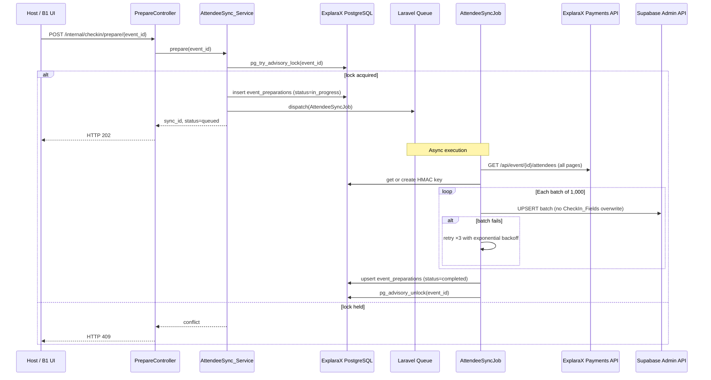

# Design Document — C1: Attendee Sync (Prepare for Check-in)

## Overview

C1 implements the attendee-sync pipeline that copies an event's full attendee roster from the ExplaraX payments service into the Supabase check-in store. A host (or an upstream B1 "Prepare" action) triggers the sync via `POST /internal/checkin/prepare/{event_id}`. The endpoint responds immediately with HTTP 202 and dispatches a background queue job that handles fetching, HMAC signing, batch upserting, and recording completion.

The design prioritises correctness (idempotency, PII stripping, atomic writes), reliability (retries with exponential backoff, concurrency guard), and observability (structured JSON logs with correlation IDs).

---

## Architecture



### Key Design Decisions

1. **Async by default.** The HTTP endpoint returns 202 immediately; all heavy work happens in a queue job. This keeps `P99 < 300ms` for the endpoint and enables retry/backoff without blocking the caller.

2. **Advisory lock over DB status check.** A PostgreSQL advisory lock (`pg_try_advisory_lock`) provides a non-blocking, transactional concurrency guard without needing a dedicated mutex table. It is automatically released if the PHP process crashes.

3. **Single job, sequential batches.** Batches are processed one at a time inside a single job to avoid Supabase rate limits and simplify retry logic. A future parallel mode can be enabled via config.

4. **Upsert with selective update columns.** The Supabase upsert explicitly lists columns in `DO UPDATE SET` and excludes `checked_in_at`, `checked_in_gate`, `checked_in_by`. This is safer than a merge strategy that could accidentally zero out live check-in state.

5. **HMAC key stored in ExplaraX core.** Keeping the key in the authoritative PostgreSQL store ensures it survives re-deploys and never appears in the check-in store or any client.

---

## Components and Interfaces

### Controller — `PrepareController`

```
namespace App\Features\AttendeeSync\Http\Controllers;

class PrepareController
{
    public function __construct(
        private readonly AttendeeSyncService $syncService
    ) {}

    public function __invoke(PrepareSyncRequest $request, int $eventId): JsonResponse
}
```

- Thin HTTP layer; delegates all logic to `AttendeeSyncService`.
- Uses `PrepareSyncRequest` form request for validation.
- Returns `PrepareResponseDTO` serialised as JSON.

### Request — `PrepareSyncRequest`

- Validates `event_id` route parameter is a positive integer.
- Applied at the route-level via form request binding.

### Service — `AttendeeSyncService`

```
namespace App\Features\AttendeeSync\Services;

class AttendeeSyncService
{
    public function __construct(
        private readonly EventPreparationRepository $prepRepo,
        private readonly HmacKeyRepository          $hmacRepo,
        private readonly AdvisoryLockService         $lockService
    ) {}

    public function prepare(int $eventId): PrepareResponseDTO
}
```

- Acquires advisory lock, creates `in_progress` record, dispatches job.
- Returns `PrepareResponseDTO` with `sync_id` and `status`.

### Job — `AttendeeSyncJob`

```
namespace App\Features\AttendeeSync\Jobs;

class AttendeeSyncJob implements ShouldQueue
{
    use Dispatchable, InteractsWithQueue, Queueable, SerializesModels;

    public int $tries  = 1;      // Retry logic is internal (batch-level)
    public int $timeout = 360;   // 6 minutes max

    public function __construct(
        private readonly int    $eventId,
        private readonly string $syncId
    ) {}

    public function handle(
        ExplaraXAttendeeRepository $attendeeRepo,
        SupabaseUpsertService      $supabaseService,
        HmacKeyRepository          $hmacRepo,
        EventPreparationRepository $prepRepo,
        SyncLogger                 $logger
    ): void
}
```

### Repository — `ExplaraXAttendeeRepository`

```
interface ExplaraXAttendeeRepository
{
    /** @return AttendeeDTO[] */
    public function fetchAllForEvent(int $eventId): array;
}
```

Implementation: `HttpExplaraXAttendeeRepository` — uses Laravel HTTP client, handles pagination, strips PII before returning DTOs.

### Repository — `HmacKeyRepository`

```
interface HmacKeyRepository
{
    public function getOrCreate(int $eventId): string; // hex key
}
```

Implementation: `PostgresHmacKeyRepository` — wraps upsert inside a DB transaction.

### Repository — `EventPreparationRepository`

```
interface EventPreparationRepository
{
    public function upsert(EventPreparationDTO $dto): void;
}
```

### Service — `SupabaseUpsertService`

```
class SupabaseUpsertService
{
    public function upsertBatch(int $batchNumber, array $rows): void;
}
```

- Posts to `{SUPABASE_URL}/rest/v1/event_attendees` with `Prefer: resolution=merge-duplicates`.
- Sets `on_conflict=ticket_id` query param.
- Retries with exponential backoff (2s → 4s → 8s, max 3 retries).

### Service — `AdvisoryLockService`

```
class AdvisoryLockService
{
    public function tryAcquire(int $lockKey): bool;
    public function release(int $lockKey): void;
}
```

### Service — `QrTokenService`

```
class QrTokenService
{
    public function sign(string $ticketId, string $hmacKey): string; // 64-char hex
}
```

- Stateless; pure function: `hash_hmac('sha256', $ticketId, $hmacKey)`.

### Service — `SyncLogger`

- Wraps Laravel's logging facade.
- Injects `sync_id` and `event_id` into every message context.
- Emits `sync.started`, `batch.completed`, `batch.retry`, `sync.completed`, `sync.failed` events.

### DTOs

| DTO | Fields |
|-----|--------|
| `AttendeeDTO` | `ticket_id`, `event_id`, `attendee_name`, `ticket_type`, `company`, `designation`, `seat`, `metadata` |
| `AttendeeUpsertDTO` | All `AttendeeDTO` fields + `qr_token` |
| `PrepareResponseDTO` | `sync_id`, `status`, `queued_at` |
| `EventPreparationDTO` | `event_id`, `sync_id`, `status`, `prepared_at`, `attendee_count`, `batch_count`, `error_message` |

---

## Data Models

### ExplaraX PostgreSQL — `event_hmac_keys`

```sql
CREATE TABLE event_hmac_keys (
    id           BIGSERIAL PRIMARY KEY,
    event_id     BIGINT        NOT NULL UNIQUE,
    hmac_key     CHAR(64)      NOT NULL,  -- hex-encoded 256-bit key
    created_at   TIMESTAMPTZ   NOT NULL DEFAULT NOW(),
    updated_at   TIMESTAMPTZ   NOT NULL DEFAULT NOW()
);

CREATE UNIQUE INDEX idx_event_hmac_keys_event_id ON event_hmac_keys (event_id);
```

### ExplaraX PostgreSQL — `event_preparations`

```sql
CREATE TABLE event_preparations (
    id              BIGSERIAL PRIMARY KEY,
    event_id        BIGINT        NOT NULL UNIQUE,
    sync_id         UUID          NOT NULL,
    status          VARCHAR(20)   NOT NULL DEFAULT 'pending',
                    -- enum: pending | in_progress | completed | failed
    attendee_count  INTEGER,
    batch_count     INTEGER,
    error_message   TEXT,
    prepared_at     TIMESTAMPTZ,
    created_at      TIMESTAMPTZ   NOT NULL DEFAULT NOW(),
    updated_at      TIMESTAMPTZ   NOT NULL DEFAULT NOW()
);

CREATE UNIQUE INDEX idx_event_preparations_event_id ON event_preparations (event_id);
CREATE INDEX        idx_event_preparations_sync_id  ON event_preparations (sync_id);
```

### Supabase — `event_attendees`

```sql
CREATE TABLE event_attendees (
    ticket_id        TEXT          PRIMARY KEY,
    event_id         TEXT          NOT NULL,
    attendee_name    TEXT          NOT NULL,
    ticket_type      TEXT,
    company          TEXT,
    designation      TEXT,
    seat             TEXT,
    qr_token         TEXT          NOT NULL UNIQUE,  -- HMAC-SHA256 hex
    metadata         JSONB         DEFAULT '{}',
    -- check-in fields managed exclusively by the check-in service:
    checked_in_at    TIMESTAMPTZ,
    checked_in_gate  TEXT,
    checked_in_by    TEXT,
    created_at       TIMESTAMPTZ   NOT NULL DEFAULT NOW(),
    updated_at       TIMESTAMPTZ   NOT NULL DEFAULT NOW()
);

CREATE INDEX idx_event_attendees_event  ON event_attendees (event_id);
CREATE INDEX idx_event_attendees_qr     ON event_attendees (qr_token);
CREATE INDEX idx_event_attendees_name   ON event_attendees (event_id, attendee_name);
```

**Upsert strategy** (executed by `SupabaseUpsertService`):

```sql
INSERT INTO event_attendees
    (ticket_id, event_id, attendee_name, ticket_type, company, designation, seat, qr_token, metadata)
VALUES (...)
ON CONFLICT (ticket_id) DO UPDATE SET
    event_id        = EXCLUDED.event_id,
    attendee_name   = EXCLUDED.attendee_name,
    ticket_type     = EXCLUDED.ticket_type,
    company         = EXCLUDED.company,
    designation     = EXCLUDED.designation,
    seat            = EXCLUDED.seat,
    qr_token        = EXCLUDED.qr_token,
    metadata        = EXCLUDED.metadata,
    updated_at      = NOW()
-- checked_in_at, checked_in_gate, checked_in_by are NOT in the DO UPDATE SET
```

### Environment Variables

| Variable | Description |
|---|---|
| `EXPLARA_PAYMENTS_URL` | Base URL for payments API |
| `EXPLARA_API_TOKEN` | Bearer token for ExplaraX APIs |
| `SUPABASE_URL` | Supabase project URL |
| `SUPABASE_SERVICE_ROLE_KEY` | Service-role key for admin upsert |
| `QUEUE_CONNECTION` | `database` (default) or `redis` |
| `SYNC_BATCH_SIZE` | Batch size, default 1000 |

---

## Correctness Properties

*A property is a characteristic or behavior that should hold true across all valid executions of a system — essentially, a formal statement about what the system should do. Properties serve as the bridge between human-readable specifications and machine-verifiable correctness guarantees.*

### Property 1: Input validation rejects invalid event IDs

*For any* value supplied as `event_id` that is not a positive integer (zero, negative integer, float, string, null, empty), the `PrepareSyncRequest` validator SHALL reject it and return HTTP 422.

**Validates: Requirements 2.2, 2.3**

---

### Property 2: Batch payload contains only allowed fields and no PII

*For any* attendee record fetched from ExplaraX (regardless of how many extra fields it contains), the corresponding row in every Batch payload sent to Supabase SHALL contain exactly and only the fields `ticket_id`, `event_id`, `attendee_name`, `ticket_type`, `company`, `designation`, `seat`, `qr_token`, `metadata`. Fields `email`, `phone`, and any payment-related field SHALL never appear.

**Validates: Requirements 4.4, 6.2, 10.1, 10.2**

---

### Property 3: HMAC key is always a 64-character lowercase hex string

*For any* call to `HmacKeyRepository::getOrCreate` for an event with no existing key, the returned string SHALL be exactly 64 characters long and SHALL contain only characters `[0-9a-f]`.

**Validates: Requirements 5.2, 5.4**

---

### Property 4: HMAC key is stable across repeated calls

*For any* event that already has a key in the HMAC_KeyStore, calling `HmacKeyRepository::getOrCreate` any number of additional times SHALL return the same key value without modification.

**Validates: Requirements 5.3, 9.4**

---

### Property 5: QR token is deterministic for any (ticket_id, hmac_key) pair

*For any* `ticket_id` string and any 64-character hex `hmac_key`, calling `QrTokenService::sign(ticket_id, hmac_key)` SHALL always return the same 64-character lowercase hex string, and repeated calls with the same inputs SHALL produce identical outputs.

**Validates: Requirements 5.5, 9.2**

---

### Property 6: Batch partitioning is correct for any attendee count

*For any* list of N attendees (N ≥ 1), the `AttendeeSyncJob` batch-splitting logic SHALL produce `⌈N / BATCH_SIZE⌉` batches, every non-final batch SHALL contain exactly `BATCH_SIZE` records, and the final batch SHALL contain `N mod BATCH_SIZE` records (or `BATCH_SIZE` if N is an exact multiple).

**Validates: Requirements 6.1**

---

### Property 7: CheckIn fields are preserved after any upsert

*For any* attendee row in Supabase that has non-null `checked_in_at`, `checked_in_gate`, or `checked_in_by` values, after the upsert SQL is applied (with any combination of attendee metadata), those three values SHALL remain unchanged.

**Validates: Requirements 7.1, 7.2, 7.3**

---

### Property 8: EventPreparation_Record is complete on successful sync

*For any* sync run that completes all batches without error, the written `EventPreparation_Record` SHALL contain non-null values for `event_id`, `sync_id`, `status` (= `"completed"`), `prepared_at`, `attendee_count`, and `batch_count`.

**Validates: Requirements 8.1, 8.2**

---

### Property 9: Sync is idempotent — running twice produces the same state

*For any* attendee list, applying the full sync twice in succession SHALL produce the identical set of Supabase attendee rows (same ticket_ids, same metadata) as applying it once. No extra rows SHALL be created and no rows SHALL be deleted by the second run.

**Validates: Requirements 9.1**

---

### Property 10: Re-sync is additive — new rows inserted, existing rows updated, none deleted

*For any* initial Supabase state with M existing attendee rows and any set of K new attendees added in ExplaraX, after a re-sync the Supabase `event_attendees` table SHALL contain at least M + K rows, the original M rows SHALL still be present with updated metadata, and no row from the original M SHALL have been deleted.

**Validates: Requirements 9.3**

---

### Property 11: Every log entry contains sync_id and event_id

*For any* sync run, every structured JSON log entry emitted by `SyncLogger` SHALL contain both a `sync_id` field (UUID v4 format) and an `event_id` field matching the running sync.

**Validates: Requirements 11.1**

---

## Error Handling

| Failure Point | Behaviour | Status |
|---|---|---|
| Invalid `event_id` | Return 422 immediately | HTTP-level |
| Rate limit exceeded | Return 429 immediately | HTTP-level |
| Advisory lock held | Return 409 immediately | HTTP-level |
| ExplaraX API non-2xx | Retry ×3 with backoff (2s, 4s, 8s); mark sync `failed` | Job-level |
| Supabase batch non-2xx | Retry that batch ×3 with backoff (2s, 4s, 8s); mark sync `failed` if exhausted | Job-level |
| DB transaction failure (HMAC write) | Rollback; mark sync `failed`; log structured error | Job-level |
| DB transaction failure (completion record) | Log `sync.completion_write_failed`; alert | Job-level |
| Job timeout (>360s) | Laravel marks job as failed; advisory lock auto-released on process exit | Queue-level |
| All errors | Stack traces never exposed to caller; generic error message returned | All levels |

**Exponential backoff formula:** `delay = 2^(attempt - 1) * 2` seconds (2s, 4s, 8s for attempts 1, 2, 3).

---

## Testing Strategy

This feature has pure business logic (HMAC signing, batch splitting, field projection, idempotent upserts) that is well-suited for property-based testing. Infrastructure interactions (HTTP calls to ExplaraX and Supabase) are tested via integration tests with mocks.

### Property-Based Testing

**Library:** [phpunit-property-based-testing via eris](https://github.com/giorgiosironi/eris) or `infection/mutation-testing-element` + custom generators, or **[PestPHP with Pest Arch + random generators](https://pestphp.com)**. Recommended choice: **[`giorgiosironi/eris`](https://github.com/giorgiosironi/eris)** for PHPUnit-native PBT in PHP.

Each property test runs a minimum of **100 iterations** per test run.

Tag format: `Feature: c1-attendee-sync, Property {N}: {property_text}`

| Property | Test class | Iterations |
|---|---|---|
| P1: Input validation | `PrepareSyncRequestPropertyTest` | 200 |
| P2: Batch payload fields | `AttendeeBatchPayloadPropertyTest` | 200 |
| P3: HMAC key format | `HmacKeyFormatPropertyTest` | 200 |
| P4: HMAC key stability | `HmacKeyStabilityPropertyTest` | 100 |
| P5: QR token determinism | `QrTokenDeterminismPropertyTest` | 200 |
| P6: Batch partitioning | `BatchPartitionPropertyTest` | 500 |
| P7: CheckIn fields preservation | `CheckInFieldsPreservationPropertyTest` | 200 |
| P8: Completion record completeness | `EventPreparationRecordPropertyTest` | 100 |
| P9: Sync idempotence | `SyncIdempotencePropertyTest` | 100 |
| P10: Re-sync additive | `ResyncAdditivePropertyTest` | 100 |
| P11: Log correlation | `SyncLogCorrelationPropertyTest` | 200 |

### Unit Tests

- `AttendeeSyncService` — concurrency guard (lock acquired / lock held)
- `QrTokenService` — specific known HMAC-SHA256 vectors
- `SupabaseUpsertService` — retry logic exhaustion, backoff delays
- `SyncLogger` — log event structure for all event types
- `HttpExplaraXAttendeeRepository` — pagination, PII stripping

### Integration Tests

- `POST /internal/checkin/prepare/{event_id}` — 202 response, sync_id in body
- `POST /internal/checkin/prepare/{event_id}` (concurrent) — 409 response
- `POST /internal/checkin/prepare/{event_id}` (rate limit) — 429 response
- Full job execution with ExplaraX mock (100 attendees) — completes, record written
- Re-sync with 50 new attendees — 50 new rows, 9,950 unchanged
- Batch retry on transient failure — job succeeds after retry

### Performance Tests

- 100 attendees → < 30s (measured with mocked HTTP)
- 10,000 attendees → < 5 minutes (measured with mocked HTTP)

### Coverage Target

Minimum 80% line coverage for all classes in `App\Features\AttendeeSync`.
