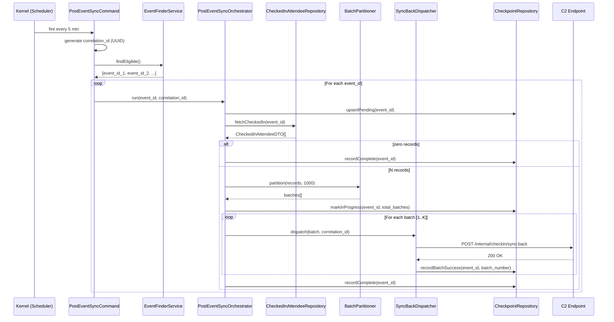
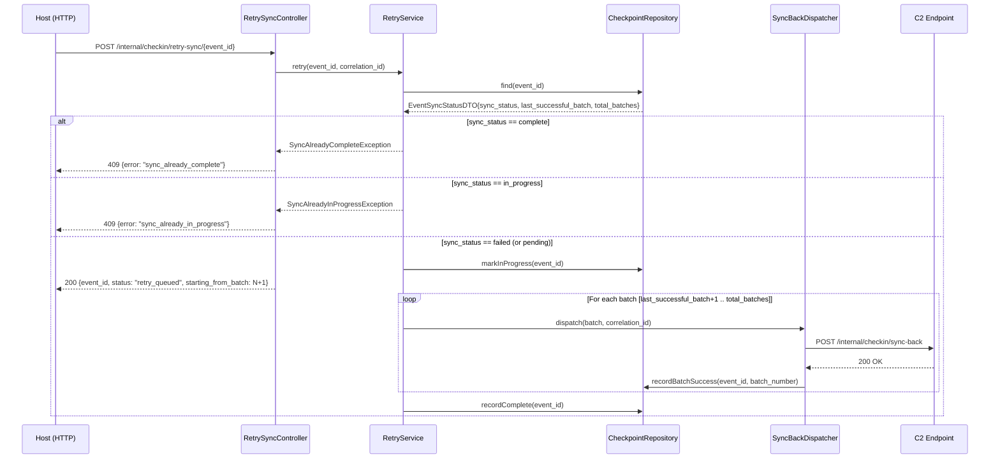
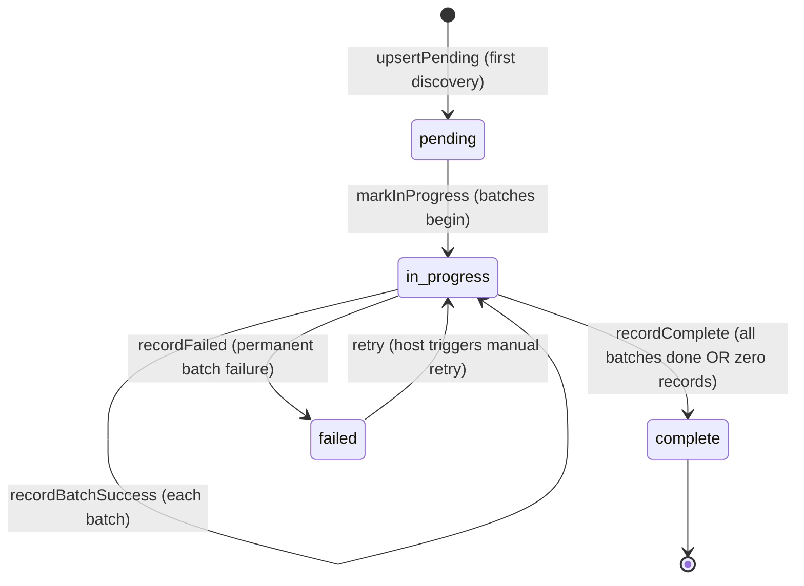

# Design Document: C3 — Post-Event Sync

## Overview

Slice C3 implements automatic post-event sync-back orchestration for ExplaraX Check-in.
After an event's `end_time` passes, the system automatically harvests all checked-in
attendee records from Supabase and delivers them to the C2 sync-back endpoint
(`POST /internal/checkin/sync-back`). If the automatic sync fails, a manual retry
endpoint resumes from the last successful batch without reprocessing any earlier batches.

C3 builds exclusively on C1 (Attendee Sync) and C2 (Sync-Back Endpoint).
It reuses `BatchPartitioner` from C1 and calls the C2 endpoint as a stable internal API.
It does **not** modify any C1 or C2 contracts.

### Key design decisions

- **Laravel Artisan command + scheduler** instead of Supabase Edge Function — keeps the
  orchestration logic in PHP alongside the rest of the backend, leverages Laravel's
  `withoutOverlapping()` guard, and avoids duplicating HTTP retry logic in JS/Deno.
- **Core PostgreSQL `event_sync_status` table** for checkpointing — single source of truth
  for scheduler, orchestrator, and retry, co-located with other core tables.
- **Deterministic `batch_id`** via `hash('sha256', event_id.':'.batch_number)` — allows C2
  to deduplicate repeated POSTs of the same batch without any extra state on the C3 side.
- **Fail-fast on permanent batch failure** — once a batch returns a non-retryable error,
  subsequent batches are abandoned and `sync_status = failed` is recorded so the host
  sees the retry button immediately.

---

## Architecture

### High-Level Diagram

```mermaid
flowchart TD
    subgraph Scheduler["Laravel Scheduler (every 5 min)"]
        CMD[PostEventSyncCommand\ncheckin:post-event-sync]
    end

    subgraph Orchestration["PostEventSyncOrchestrator"]
        EF[EventFinderService\nfindEligible]
        CAR[CheckedInAttendeeRepository\nfetchCheckedIn]
        BP[BatchPartitioner\npartition — 1,000/batch]
        SBD[SyncBackDispatcher\nPOST /internal/checkin/sync-back]
        CP[CheckpointRepository\nread / write event_sync_status]
    end

    subgraph RetryPath["Manual Retry"]
        RSC[RetrySyncController\nPOST /internal/checkin/retry-sync/{event_id}]
        RS[RetryService]
    end

    subgraph External["External Systems"]
        SB[(Supabase\nevent_attendees)]
        C2[C2 SyncBack Endpoint\nPOST /internal/checkin/sync-back]
        PG[(Core PostgreSQL\nevent_sync_status)]
    end

    CMD -->|generates correlation_id| EF
    EF -->|queries| PG
    EF -->|eligible event_ids| CMD
    CMD -->|per event| CAR
    CAR -->|GET checked_in_at IS NOT NULL| SB
    CAR --> BP
    BP -->|batches| SBD
    SBD -->|POST + Authorization header| C2
    SBD -->|recordBatchSuccess / recordFailed| CP
    CP -->|upsert| PG

    RSC -->|validates| RS
    RS -->|reads checkpoint| CP
    RS -->|re-dispatches from N+1| SBD

    subgraph Logger["PostEventSyncLogger (all services)"]
        LOG[Log::channel('json_daily')\ncorrelation_id + event_id + sync_status]
    end

    CMD -.->|injects| LOG
    SBD -.->|injects| LOG
    RS  -.->|injects| LOG
```

### Automatic Sync Data Flow



### Manual Retry Data Flow



---

## Components and Interfaces

### Contracts

#### `CheckedInAttendeeRepository`
```php
namespace App\Features\PostEventSync\Contracts;

interface CheckedInAttendeeRepository
{
    /**
     * Fetch all tickets for $eventId where checked_in_at IS NOT NULL from Supabase.
     * Returns CheckedInAttendeeDTO[] — empty array if no check-ins.
     */
    public function fetchCheckedIn(string $eventId): array;
}
```

#### `CheckpointRepository`
```php
namespace App\Features\PostEventSync\Contracts;

use App\Features\PostEventSync\DTOs\EventSyncStatusDTO;

interface CheckpointRepository
{
    /** Insert pending row (no-op if row already exists — idempotent). */
    public function upsertPending(string $eventId): void;

    /** Transition from pending → in_progress; set total_batches. */
    public function markInProgress(string $eventId, int $totalBatches): void;

    /** Atomically set last_successful_batch = N and sync_status = in_progress. */
    public function recordBatchSuccess(string $eventId, int $batchNumber): void;

    /** Set sync_status = complete, completed_at = NOW(). */
    public function recordComplete(string $eventId): void;

    /** Set sync_status = failed, error_message = $message. */
    public function recordFailed(string $eventId, string $message): void;

    /** Read current checkpoint row; null if no row exists yet. */
    public function find(string $eventId): ?EventSyncStatusDTO;
}
```

#### `EventFinderContract`
```php
namespace App\Features\PostEventSync\Contracts;

interface EventFinderContract
{
    /**
     * Return event_id strings for events where end_time < NOW()
     * AND sync_status <> 'complete'.
     *
     * @return string[]
     */
    public function findEligible(): array;
}
```

### DTOs

#### `CheckedInAttendeeDTO`
```php
namespace App\Features\PostEventSync\DTOs;

readonly class CheckedInAttendeeDTO
{
    public function __construct(
        public string $ticket_id,
        public string $checked_in_at,
        public string $checked_in_gate,
        public string $checked_in_by,
        public string $checkin_method,
    ) {}

    /** Construct from a raw Supabase REST row. */
    public static function fromSupabaseRow(array $row): self;

    /** Converts to CheckinRecordDTO shape for the C2 payload. */
    public function toCheckinRecord(): array;
}
```

#### `EventSyncStatusDTO`
```php
namespace App\Features\PostEventSync\DTOs;

readonly class EventSyncStatusDTO
{
    public function __construct(
        public string  $event_id,
        public string  $sync_status,        // pending|in_progress|complete|failed
        public int     $last_successful_batch,
        public ?int    $total_batches,
        public ?string $completed_at,
        public ?string $error_message,
    ) {}
}
```

#### `SyncBatchDTO`
```php
namespace App\Features\PostEventSync\DTOs;

readonly class SyncBatchDTO
{
    /**
     * @param CheckedInAttendeeDTO[] $records
     */
    public function __construct(
        public string $event_id,
        public int    $batch_number,
        public string $batch_id,            // hash('sha256', event_id.':'.batch_number)
        public array  $records,
    ) {}
}
```

### Exceptions

```php
// General orchestration failure
class PostEventSyncException extends \RuntimeException {}

// Thrown by RetryService when event is already complete — maps to HTTP 409
class SyncAlreadyCompleteException extends PostEventSyncException {}

// Thrown by RetryService when event is currently in_progress — maps to HTTP 409
class SyncAlreadyInProgressException extends PostEventSyncException {}
```

### Services

#### `EventFinderService`
```php
namespace App\Features\PostEventSync\Services;

class EventFinderService implements EventFinderContract
{
    public function __construct(private readonly \Illuminate\Database\ConnectionInterface $db) {}

    /**
     * SELECT event_id FROM event_sync_status
     * WHERE sync_status <> 'complete'
     *   AND event_id IN (
     *       SELECT id FROM events WHERE end_time < NOW()
     *   )
     *
     * @return string[]
     */
    public function findEligible(): array;
}
```

#### `SyncBackDispatcher`
```php
namespace App\Features\PostEventSync\Services;

class SyncBackDispatcher
{
    private const MAX_RETRIES  = 3;
    private const RETRY_DELAYS = [0, 2, 4, 8]; // seconds (index = attempt, 0-based)

    public function __construct(
        private readonly CheckpointRepository    $checkpointRepo,
        private readonly PostEventSyncLogger     $logger,
    ) {}

    /**
     * POST the batch to C2. Retries on 5xx / 429 / network timeout.
     * Treats 4xx (except 429) as permanent failure — no retry.
     *
     * On success:  calls checkpointRepo->recordBatchSuccess()
     * On failure:  calls checkpointRepo->recordFailed(), emits critical alert,
     *              throws PostEventSyncException to stop the orchestrator.
     */
    public function dispatch(SyncBatchDTO $batch, string $correlationId): void;

    /**
     * Derive a deterministic batch_id.
     * hash('sha256', $eventId . ':' . $batchNumber)
     */
    public static function deriveBatchId(string $eventId, int $batchNumber): string;
}
```

#### `PostEventSyncOrchestrator`
```php
namespace App\Features\PostEventSync\Services;

class PostEventSyncOrchestrator
{
    public function __construct(
        private readonly CheckedInAttendeeRepository $attendeeRepo,
        private readonly CheckpointRepository        $checkpointRepo,
        private readonly SyncBackDispatcher          $dispatcher,
        private readonly PostEventSyncLogger         $logger,
    ) {}

    /**
     * Full pipeline for a single event:
     *   1. upsertPending
     *   2. fetchCheckedIn
     *   3. If 0 records → recordComplete, return
     *   4. partition into batches of 1,000
     *   5. markInProgress(total_batches)
     *   6. For each batch: dispatcher->dispatch()
     *   7. recordComplete
     *
     * Exceptions from dispatcher propagate up — orchestrator does NOT catch
     * permanent failures; PostEventSyncCommand handles multi-event isolation.
     */
    public function run(string $eventId, string $correlationId): void;
}
```

#### `RetryService`
```php
namespace App\Features\PostEventSync\Services;

class RetryService
{
    public function __construct(
        private readonly CheckpointRepository    $checkpointRepo,
        private readonly CheckedInAttendeeRepository $attendeeRepo,
        private readonly SyncBackDispatcher      $dispatcher,
        private readonly PostEventSyncLogger     $logger,
    ) {}

    /**
     * Read current checkpoint. Guard against complete/in_progress.
     * Set sync_status = in_progress atomically.
     * Re-fetch all checked-in records (source of truth from Supabase).
     * Re-partition using BatchPartitioner (same batch_ids because derived
     *   deterministically — C2 will deduplicate any already-applied batches).
     * Dispatch from batch (last_successful_batch + 1) onwards.
     *
     * @throws SyncAlreadyCompleteException  if sync_status == complete
     * @throws SyncAlreadyInProgressException if sync_status == in_progress
     *
     * @return int  The batch number retry will start from
     */
    public function retry(string $eventId, string $correlationId): int;
}
```

#### `PostEventSyncLogger`
```php
namespace App\Features\PostEventSync\Services;

class PostEventSyncLogger
{
    public function __construct(
        private readonly string $correlationId,
        private readonly string $eventId,
    ) {}

    public function syncStarted(): void;
    public function syncCompleted(int $totalBatches, int $durationMs): void;
    public function syncFailed(string $errorMessage): void;
    public function batchAttempt(int $batchNumber, string $batchId, int $attempt): void;
    public function batchSuccess(int $batchNumber, string $batchId, int $durationMs): void;
    public function batchFailed(int $batchNumber, string $batchId, string $error, bool $permanent): void;
    public function monitoringAlert(int $batchNumber, string $batchId, string $errorMessage): void;

    /** All entries include correlation_id, event_id, sync_status. */
    private function log(string $level, string $event, array $context = []): void;
}
```

### Repositories

#### `PostgresCheckedInAttendeeRepository`

Implements `CheckedInAttendeeRepository`. Issues a Supabase REST API `GET` request
using the same HTTP pattern as `SupabaseUpsertService`:

```
GET {SUPABASE_URL}/rest/v1/event_attendees
    ?event_id=eq.{event_id}
    &checked_in_at=not.is.null
    &select=ticket_id,checked_in_at,checked_in_gate,checked_in_by,checkin_method
Headers:
  Authorization: Bearer {SUPABASE_SERVICE_ROLE_KEY}
  apikey: {SUPABASE_SERVICE_ROLE_KEY}
```

Applies the same exponential backoff as `HttpExplaraXAttendeeRepository`:
delays `[0, 2, 4, 8]` seconds, up to 3 attempts, respects `SUPABASE_RETRY_DELAY` env var.

#### `PostgresCheckpointRepository`

Implements `CheckpointRepository`. Uses Laravel `DB::statement()` with raw SQL
(same pattern as `PostgresEventPreparationRepository`) for atomic `INSERT ... ON CONFLICT`
and targeted `UPDATE` statements. All writes are single SQL statements — no transactions
needed because each write is already atomic.

### Commands

#### `PostEventSyncCommand`
```php
namespace App\Features\PostEventSync\Commands;

use Illuminate\Console\Command;

class PostEventSyncCommand extends Command
{
    protected $signature   = 'checkin:post-event-sync';
    protected $description = 'Automatically sync checked-in attendees back to ExplaraX for ended events.';

    public function __construct(
        private readonly EventFinderContract         $eventFinder,
        private readonly PostEventSyncOrchestrator   $orchestrator,
    ) {}

    /**
     * 1. Generate correlation_id.
     * 2. Call eventFinder->findEligible().
     * 3. For each event_id: try orchestrator->run(); catch and log, continue to next.
     * 4. Return exit code 0 always (failures are logged, not escalated to the scheduler).
     */
    public function handle(): int;
}
```

Registered in `Kernel.php`:
```php
$schedule->command('checkin:post-event-sync')
    ->everyFiveMinutes()
    ->withoutOverlapping();
```

### HTTP Layer

#### `RetrySyncController`
```
POST /internal/checkin/retry-sync/{event_id}
Middleware: VerifySharedSecret (reused from C2 — same CHECKIN_SYNC_BACK_SECRET)
```

```php
namespace App\Features\PostEventSync\Http\Controllers;

class RetrySyncController extends Controller
{
    public function __invoke(RetrySyncRequest $request, string $eventId): JsonResponse
    {
        $correlationId = (string) ($request->attributes->get('request_id') ?? Str::uuid());
        $startingFrom  = $this->retryService->retry($eventId, $correlationId);

        return response()->json([
            'event_id'            => $eventId,
            'status'              => 'retry_queued',
            'starting_from_batch' => $startingFrom,
        ]);
    }
}
```

On `SyncAlreadyCompleteException` → `409 { "error": "sync_already_complete" }`
On `SyncAlreadyInProgressException` → `409 { "error": "sync_already_in_progress" }`
(handled by Laravel exception handler registered in `PostEventSyncServiceProvider`)

### Service Provider

```php
namespace App\Providers;

class PostEventSyncServiceProvider extends ServiceProvider
{
    public function register(): void
    {
        $this->app->bind(CheckedInAttendeeRepository::class,
                         PostgresCheckedInAttendeeRepository::class);
        $this->app->bind(CheckpointRepository::class,
                         PostgresCheckpointRepository::class);
        $this->app->bind(EventFinderContract::class,
                         EventFinderService::class);
    }

    public function boot(): void
    {
        // Register retry endpoint
        $this->loadRoutesFrom(
            base_path('routes/post_event_sync.php')
        );

        // Register artisan command
        if ($this->app->runningInConsole()) {
            $this->commands([PostEventSyncCommand::class]);
        }

        // Map domain exceptions to HTTP responses
        $this->app->make(\Illuminate\Contracts\Debug\ExceptionHandler::class)
            ->renderable(function (SyncAlreadyCompleteException $e) {
                return response()->json(['error' => 'sync_already_complete'], 409);
            })
            ->renderable(function (SyncAlreadyInProgressException $e) {
                return response()->json(['error' => 'sync_already_in_progress'], 409);
            });
    }
}
```

Registered in `config/app.php` providers array:
```php
App\Providers\PostEventSyncServiceProvider::class,
```

### Reused from C1

`App\Features\AttendeeSync\Support\BatchPartitioner::partition(array $records, int $batchSize): array`
is called directly — no wrapper, no re-implementation.

---

## Data Models

### `event_sync_status` Table (Core PostgreSQL)

```sql
CREATE TABLE event_sync_status (
    id                    BIGSERIAL    PRIMARY KEY,
    event_id              VARCHAR(100) NOT NULL,
    sync_status           VARCHAR(20)  NOT NULL DEFAULT 'pending',
    last_successful_batch INTEGER      NOT NULL DEFAULT 0,
    total_batches         INTEGER      NULL,
    completed_at          TIMESTAMPTZ  NULL,
    error_message         TEXT         NULL,
    created_at            TIMESTAMPTZ  NOT NULL DEFAULT NOW(),
    updated_at            TIMESTAMPTZ  NOT NULL DEFAULT NOW(),

    CONSTRAINT uq_event_sync_status_event_id UNIQUE (event_id)
);

-- Supports EventFinderService query: sync_status != complete AND events.end_time < NOW()
CREATE INDEX idx_event_sync_status_eligible
    ON event_sync_status (sync_status)
    WHERE sync_status <> 'complete';
```

`sync_status` valid values: `pending` | `in_progress` | `complete` | `failed`

### Laravel Migration Pattern

Matches `create_event_preparations_table.php` exactly:

```php
Schema::create('event_sync_status', function (Blueprint $table) {
    $table->bigIncrements('id');
    $table->string('event_id', 100);
    $table->string('sync_status', 20)->default('pending');
    $table->integer('last_successful_batch')->default(0);
    $table->integer('total_batches')->nullable();
    $table->timestampTz('completed_at')->nullable();
    $table->text('error_message')->nullable();
    $table->timestamp('created_at')->useCurrent();
    $table->timestamp('updated_at')->useCurrent();

    $table->unique('event_id', 'uq_event_sync_status_event_id');
    $table->index('sync_status', 'idx_event_sync_status_eligible');
});
```

### `event_sync_status` State Machine



### Supabase Query (read-only)

```
GET {SUPABASE_URL}/rest/v1/event_attendees
    ?event_id=eq.{event_id}
    &checked_in_at=not.is.null
    &select=ticket_id,checked_in_at,checked_in_gate,checked_in_by,checkin_method
```

C3 never writes to Supabase. All Supabase interaction is read-only.

---

## Idempotency Mechanisms

### Deterministic `batch_id`

Every batch sent to C2 carries a `batch_id` computed as:

```php
$batchId = hash('sha256', $eventId . ':' . $batchNumber);
```

Because `event_id` and `batch_number` are stable across retries, the same batch always
produces the same `batch_id`. C2's deduplication logic (by `ticket_id + checked_in_at`)
suppresses duplicate application of the same check-in record when C3 retries a batch.

### `upsertPending` is a no-op on conflict

`PostgresCheckpointRepository::upsertPending` uses `INSERT ... ON CONFLICT (event_id) DO NOTHING`.
If the scheduler fires while a previous run is already in `in_progress`, the row already
exists and nothing changes. The `EventFinderService` returns `in_progress` events, but
`withoutOverlapping()` prevents the command from running concurrently.

### Retry resumes, not restarts

`RetryService` re-fetches all checked-in records from Supabase (source of truth) and
re-partitions with the same batch size. Because `batch_id` is deterministic, batches
`1..last_successful_batch` will produce the same `batch_id` values and C2 will treat
them as already-applied duplicates. Only batches `last_successful_batch+1..total_batches`
will be newly applied.

---

## Error Handling and Monitoring

### Retry Classification in `SyncBackDispatcher`

| C2 HTTP Status | Classification | Action |
|---|---|---|
| 200 | Success | `recordBatchSuccess`, continue |
| 429 | Transient | Exponential backoff, up to 3 attempts |
| 5xx | Transient | Exponential backoff, up to 3 attempts |
| Network timeout | Transient | Exponential backoff, up to 3 attempts |
| 4xx (non-429) | Permanent | `recordFailed`, emit alert, stop |
| All retries exhausted | Permanent | `recordFailed`, emit alert, stop |

Backoff delays: attempt 1 = 2 s, attempt 2 = 4 s, attempt 3 = 8 s.
Controlled by `SUPABASE_RETRY_DELAY` env var multiplier (set to 0 in tests).

### Permanent Failure Behavior

When `SyncBackDispatcher` declares a permanent failure:

1. Calls `checkpointRepo->recordFailed($eventId, $errorMessage)`.
   - `error_message` = `"HTTP {status}: {substr(body, 0, 500)}"` (500-char cap).
2. Emits a `critical` log entry via `PostEventSyncLogger::monitoringAlert()`.
   - Channel resolved from `config('logging.channels.post_event_sync_alerts', 'stack')`.
   - Contains `event_id`, `batch_number`, `error_message`, `correlation_id`.
3. Throws `PostEventSyncException` to the orchestrator.
4. Orchestrator does NOT catch this exception — propagates to the command.
5. Command catches it per-event, logs, and continues to the next eligible event.

This ensures one failing event never blocks other events in the same scheduler tick.

### Multi-Event Isolation in `PostEventSyncCommand`

```php
foreach ($eventIds as $eventId) {
    try {
        $this->orchestrator->run($eventId, $correlationId);
    } catch (\Throwable $e) {
        $this->logger->syncFailed($e->getMessage());
        // Continue to next event — do NOT rethrow
    }
}
```

---

## Logging Strategy

All log entries are written to `Log::channel('json_daily')` (matching C1's `SyncLogger`).

### Required Fields on Every Entry

| Field | Source |
|---|---|
| `correlation_id` | Generated once per scheduler run (or per retry invocation), propagated via constructor injection on `PostEventSyncLogger` |
| `event_id` | Injected into logger at construction |
| `sync_status` | Included by each log method — reflects current status at time of log |

### Log Events

| Event Name | Level | When | Extra Fields |
|---|---|---|---|
| `post_event_sync.started` | info | Command start | `eligible_event_count` |
| `post_event_sync.event.started` | info | Orchestrator enters event | — |
| `post_event_sync.batch.attempt` | info | Each dispatch attempt | `batch_number`, `batch_id`, `attempt` |
| `post_event_sync.batch.success` | info | C2 returns 200 | `batch_number`, `batch_id`, `duration_ms` |
| `post_event_sync.batch.failed` | error | Permanent failure | `batch_number`, `batch_id`, `http_status`, `error_message` |
| `post_event_sync.event.complete` | info | All batches done | `total_batches`, `duration_ms` |
| `post_event_sync.event.zero_records` | info | No check-ins found | — |
| `post_event_sync.monitoring_alert` | **critical** | Permanent batch failure | `batch_number`, `batch_id`, `error_message` |
| `post_event_sync.retry.started` | info | Retry endpoint called | `starting_from_batch` |
| `post_event_sync.retry.guard.complete` | warning | Retry rejected (complete) | — |
| `post_event_sync.retry.guard.in_progress` | warning | Retry rejected (in progress) | — |

### Correlation ID Propagation

A new `correlation_id` is generated at two entry points:

1. **Scheduler run** — `PostEventSyncCommand::handle()` generates one UUID before
   calling `EventFinderService`. That UUID is passed through to `PostEventSyncOrchestrator`
   and into `SyncBackDispatcher` and `PostEventSyncLogger` constructor.
2. **Manual retry** — `RetrySyncController` reads `request_id` from the
   `VerifySharedSecret` middleware attribute (same middleware reused from C2), falling
   back to a new UUID.

---

## DI / Service Provider Wiring

```
PostEventSyncServiceProvider::register()
├── CheckedInAttendeeRepository  → PostgresCheckedInAttendeeRepository
├── CheckpointRepository         → PostgresCheckpointRepository
└── EventFinderContract          → EventFinderService

PostEventSyncServiceProvider::boot()
├── loadRoutesFrom('routes/post_event_sync.php')
│     └── POST /internal/checkin/retry-sync/{event_id}
│           → RetrySyncController (middleware: VerifySharedSecret)
├── commands([PostEventSyncCommand::class])
└── ExceptionHandler::renderable()
      ├── SyncAlreadyCompleteException   → 409
      └── SyncAlreadyInProgressException → 409
```

`PostEventSyncLogger` is **not** bound in the container — it is constructed explicitly
with the `correlation_id` and `event_id` at the start of each orchestration run, then
passed by reference to collaborators that need it. This ensures per-run isolation and
matches the pattern used by C1's `SyncLogger`.

---

## Correctness Properties

*A property is a characteristic or behavior that should hold true across all valid
executions of a system — essentially, a formal statement about what the system should do.
Properties serve as the bridge between human-readable specifications and
machine-verifiable correctness guarantees.*

### Property 1: BatchPartitioner Round-Trip

*For any* array of N checked-in records, partitioning with batch size 1,000 and then
flattening all batches SHALL produce a result that is identical to the original array —
same records, same count, same order. Additionally, every non-final batch SHALL have
exactly 1,000 records, the final batch SHALL have between 1 and 1,000 records inclusive,
and the number of batches SHALL equal `ceil(N / 1000)`.

**Validates: Requirements 3.2, 3.3, 3.4**

### Property 2: EventFinder Eligibility Filter

*For any* collection of `event_sync_status` rows with arbitrary combinations of
`sync_status` values (`pending`, `in_progress`, `complete`, `failed`) and arbitrary
`end_time` values, `EventFinderService::findEligible()` SHALL return exactly the subset
where `end_time < NOW()` AND `sync_status <> 'complete'` — no more, no less.

**Validates: Requirements 1.2, 1.3, 1.6**

### Property 3: CheckedIn Attendee Filter

*For any* event with N tickets where K have `checked_in_at IS NOT NULL` and (N−K) have
`checked_in_at IS NULL`, `CheckedInAttendeeRepository::fetchCheckedIn()` SHALL return
exactly K records, each containing all five required fields (`ticket_id`, `checked_in_at`,
`checked_in_gate`, `checked_in_by`, `checkin_method`), and SHALL NOT return any record
where `checked_in_at` is null or absent.

**Validates: Requirements 2.1, 2.2, 2.4**

### Property 4: Deterministic Batch ID

*For any* `event_id` string and `batch_number` integer, calling
`SyncBackDispatcher::deriveBatchId(event_id, batch_number)` SHALL always return the same
value. Two calls with the same inputs MUST produce identical `batch_id` strings;
two calls with different `(event_id, batch_number)` pairs MUST produce different strings.

**Validates: Requirements 4.2, 9.2**

### Property 5: Checkpoint Monotonicity

*For any* sync run processing batches in order `1..K`, the value of
`last_successful_batch` in `event_sync_status` SHALL never decrease between consecutive
checkpoint writes. After `recordBatchSuccess(event_id, N)` is called, a subsequent
`find(event_id)` SHALL return `last_successful_batch >= N`.

**Validates: Requirement 5.1**

### Property 6: Retry Resume Correctness

*For any* `last_successful_batch` value N (where N ≥ 0), when `RetryService::retry()` is
called for a `failed` event, the first batch dispatched to `SyncBackDispatcher` SHALL
have `batch_number = N + 1`. When N = 0, the first batch dispatched SHALL be batch 1.

**Validates: Requirements 6.1, 6.2, 6.3**

### Property 7: Retry Idempotency

*For any* failed event with `last_successful_batch = N` and `total_batches = K`,
calling `RetryService::retry()` twice in sequence on the same event (resetting status to
`failed` between calls) SHALL produce the same final `sync_status` (`complete`) and
the same `last_successful_batch` value (K), as a single retry call.

**Validates: Requirement 6.6**

### Property 8: Failure Stops Subsequent Batch Processing

*For any* multi-batch sync run where batch number M fails permanently, the
`PostEventSyncOrchestrator` SHALL dispatch at most M batches total — no batch with
`batch_number > M` SHALL ever be dispatched to `SyncBackDispatcher` for that run.

**Validates: Requirement 7.3**

### Property 9: Error Message Shape

*For any* permanent C2 failure with HTTP status code S and response body of arbitrary
length, the `error_message` persisted to `event_sync_status` SHALL contain the string
representation of S and SHALL have total length ≤ 500 characters. For bodies longer
than 500 characters, the message SHALL be a truncated prefix.

**Validates: Requirement 7.4**

### Property 10: Zero-Record Completion

*For any* event where `CheckedInAttendeeRepository::fetchCheckedIn()` returns an empty
array, `PostEventSyncOrchestrator::run()` SHALL set `sync_status = complete` in the
checkpoint and SHALL make zero HTTP POST calls to the C2 endpoint.

**Validates: Requirement 2.3**

### Property 11: Structured Log Completeness

*For any* service invocation (dispatcher, orchestrator, retry service), every structured
log entry emitted by `PostEventSyncLogger` SHALL include `correlation_id`, `event_id`,
and `sync_status` fields. Dispatcher log entries SHALL additionally include `batch_number`,
`batch_id`, and `duration_ms`.

**Validates: Requirements 4.7, 10.2, 10.3**

### Property 12: `total_batches` Accuracy

*For any* event with N checked-in records, once `CheckpointRepository::markInProgress()`
is called, the `total_batches` value persisted to `event_sync_status` SHALL equal
`ceil(N / 1000)`.

**Validates: Requirement 8.3**

---

## Testing Strategy

### Property-Based Testing

Use **PestPHP with `pestphp/pest-plugin-arch`** + a custom generator helper, or
**phpspec/prophecy** for mocks. For PHP, PBT is implemented with
[**`infinityloop-dev/phpbt`**](https://github.com/infinityloop-dev/phpbt) or by writing
a simple `forAll()` loop with a Faker-backed generator (100 iterations minimum).

Each property test MUST carry a tag comment referencing its property:

```php
// Feature: c3-post-event-sync, Property 1: BatchPartitioner round-trip
it('round-trips any array through partition+flatten', function () {
    for ($i = 0; $i < 100; $i++) {
        $n       = random_int(0, 5000);
        $records = range(1, $n);   // or array of fake DTOs
        $batches = BatchPartitioner::partition($records, 1000);
        expect(array_merge(...$batches))->toBe($records);
        // ... assert count, non-final sizes, etc.
    }
});
```

#### Property → Test Mapping

| Property | Test file | Iterations |
|---|---|---|
| P1 BatchPartitioner round-trip | `BatchPartitionerPropertyTest.php` (reuse/extend C1) | 100 |
| P2 EventFinder eligibility filter | `EventFinderServicePropertyTest.php` | 100 |
| P3 CheckedIn attendee filter | `PostgresCheckedInAttendeeRepositoryPropertyTest.php` | 100 |
| P4 Deterministic batch_id | `SyncBackDispatcherPropertyTest.php` | 100 |
| P5 Checkpoint monotonicity | `PostgresCheckpointRepositoryPropertyTest.php` | 100 |
| P6 Retry resume correctness | `RetryServicePropertyTest.php` | 100 |
| P7 Retry idempotency | `RetryServicePropertyTest.php` | 100 |
| P8 Failure stops batches | `PostEventSyncOrchestratorPropertyTest.php` | 100 |
| P9 Error message shape | `SyncBackDispatcherPropertyTest.php` | 100 |
| P10 Zero-record completion | `PostEventSyncOrchestratorTest.php` (example) | 1 |
| P11 Log completeness | `PostEventSyncLoggerPropertyTest.php` | 100 |
| P12 total_batches accuracy | `PostgresCheckpointRepositoryPropertyTest.php` | 100 |

### Unit Tests (Example-Based)

Cover the specific examples and edge cases not addressed by properties:

- `EventFinderServiceTest` — zero eligible events returns empty array
- `PostEventSyncOrchestratorTest` — pending row inserted on first discovery;
  in_progress transition before first batch
- `SyncBackDispatcherTest` — 200 calls `recordBatchSuccess`; 500 retries 3×;
  4xx (non-429) permanent failure; 429 retries 3×
- `RetrySyncControllerTest` — 409 on `complete`; 409 on `in_progress`; 200 on `failed`
- `RetryServiceTest` — `last_successful_batch = 0` starts from batch 1;
  `in_progress` guard; `complete` guard
- `PostEventSyncCommandTest` — failure on one event does not prevent processing others
- `PostgresCheckedInAttendeeRepositoryTest` — Supabase REST query built correctly;
  retry on Supabase 500

### Integration Tests

- End-to-end: insert `event_sync_status` row as `pending`, run command, assert `complete`
  with `last_successful_batch = ceil(N/1000)`
- Partial failure: mock C2 to fail on batch 3, assert `sync_status = failed`,
  `last_successful_batch = 2`
- Retry integration: set state to `failed` at batch 2, call retry endpoint, assert
  `complete` with no re-processing of batches 1 and 2 (C2 POST count = total_batches − 2)

### Smoke Tests

- `event_sync_status` unique constraint enforced (duplicate `event_id` insert rejected)
- Scheduler registration: `checkin:post-event-sync` registered at 5-minute interval
  with `withoutOverlapping()`
